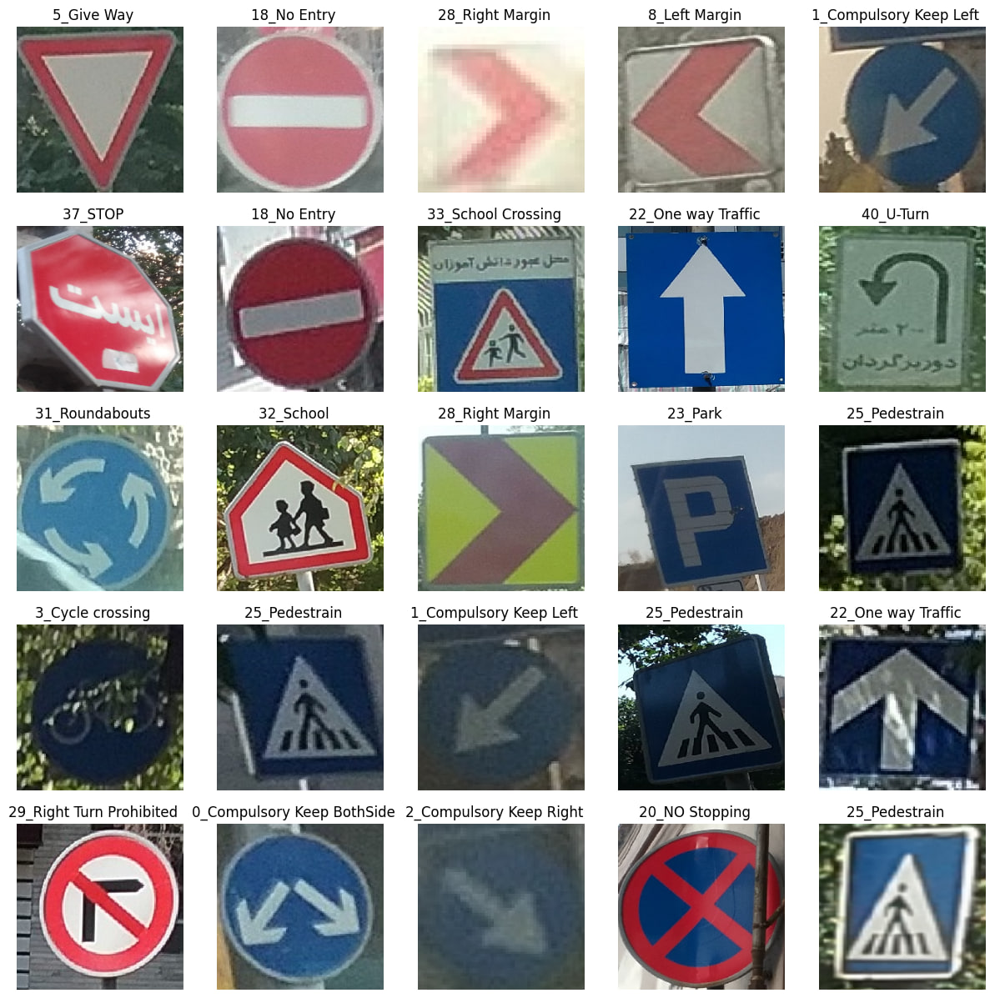

Pass this code a picture of an Iranian traffic sign and it will tell you what the sign is, known signs are as follows: <br />
```
Compulsory Keep BothSide
Compulsory Keep Left
Compulsory Keep Right
Cycle crossing
Danger
Give Way
Hump
Left Bend
Left Margin
Left Turn Prohibited
Maximum Speed 30
Maximum Speed 40
Maximum Speed 50
Maximum Speed 60
Maximum Speed 70
Maximum Speed 80
Maximum Speed 90
MotorCycle Prohibited
NO Stopping
NO Waitin
NO Waiting
No Entry
No Horn
One way Traffic
Park
Park Forbidden
Pedestrain
Pedestrian crossing
Right Bend
Right Margin
Right Turn Prohibited
Road Work
Roundabouts
STOP
School
School Crossing
Side Road Right
Slow
Speed Camera
Truck Prohibited
Two Way Traffic
U-Turn
U-Turn Allowed
U-turn Prohibited
```



This is the trained model of amin98hosseini's dataset:  <br />

[amin98hosseini](https://www.kaggle.com/datasets/saraparsaseresht/persian-traffic-sign-dataset-ptsd "amin98hosseini")
